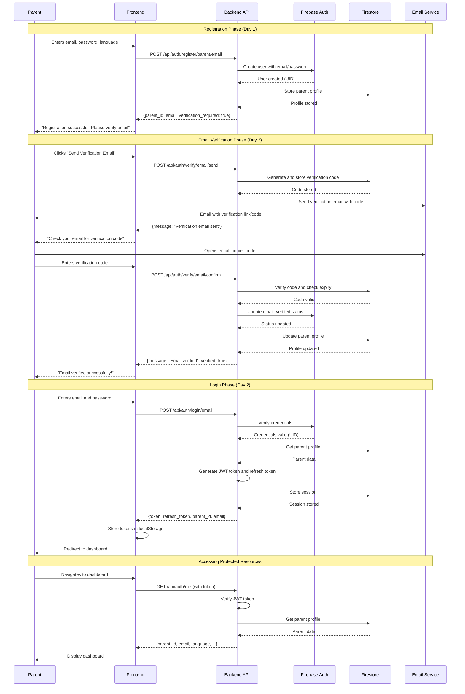
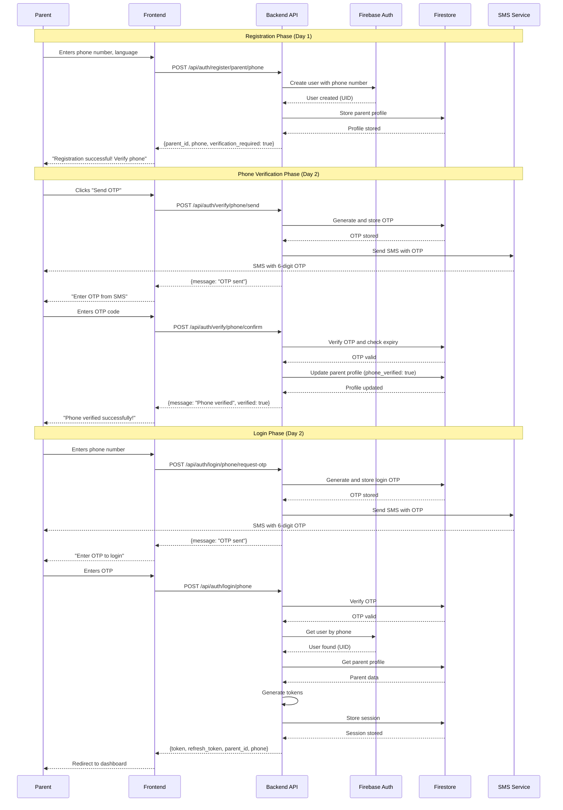
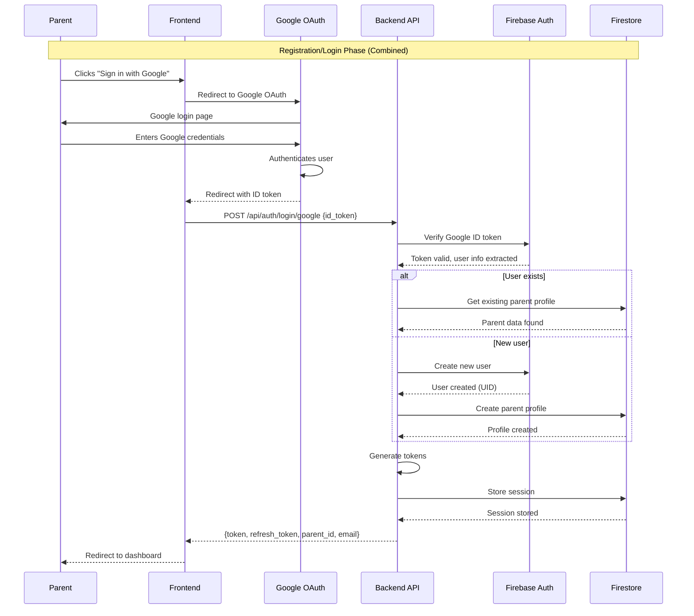
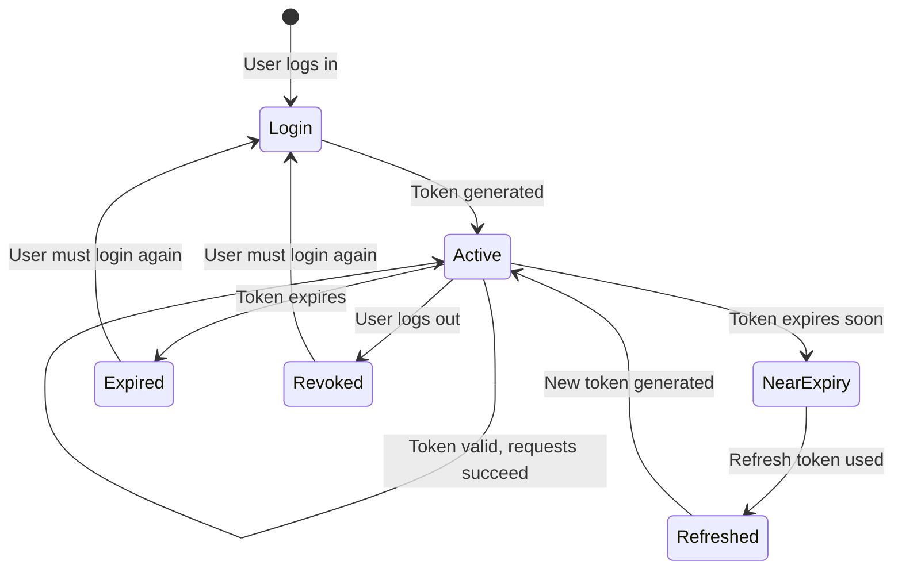
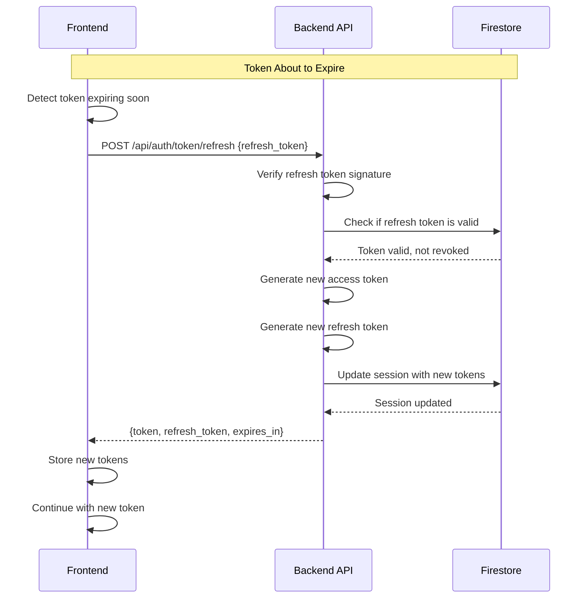
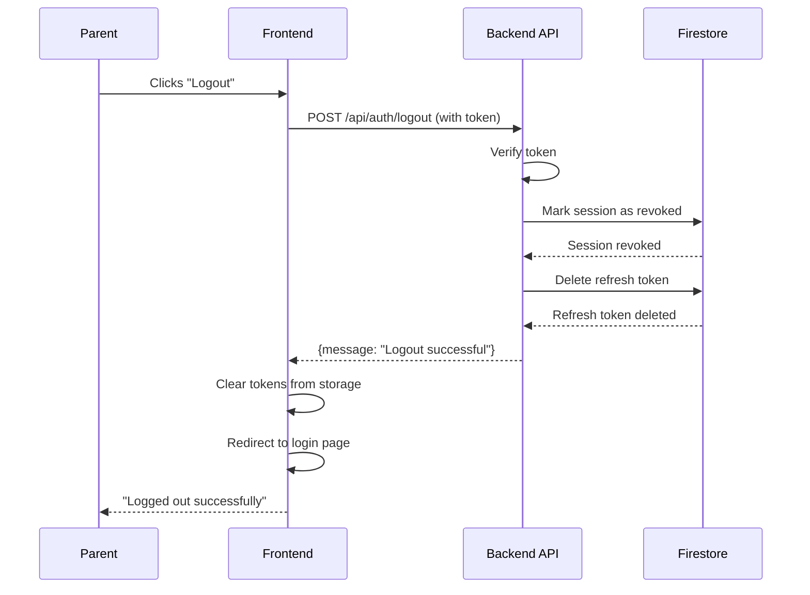
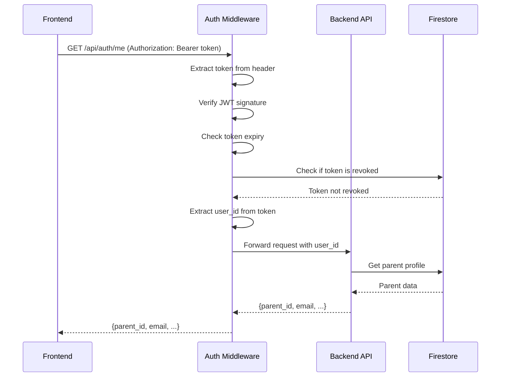
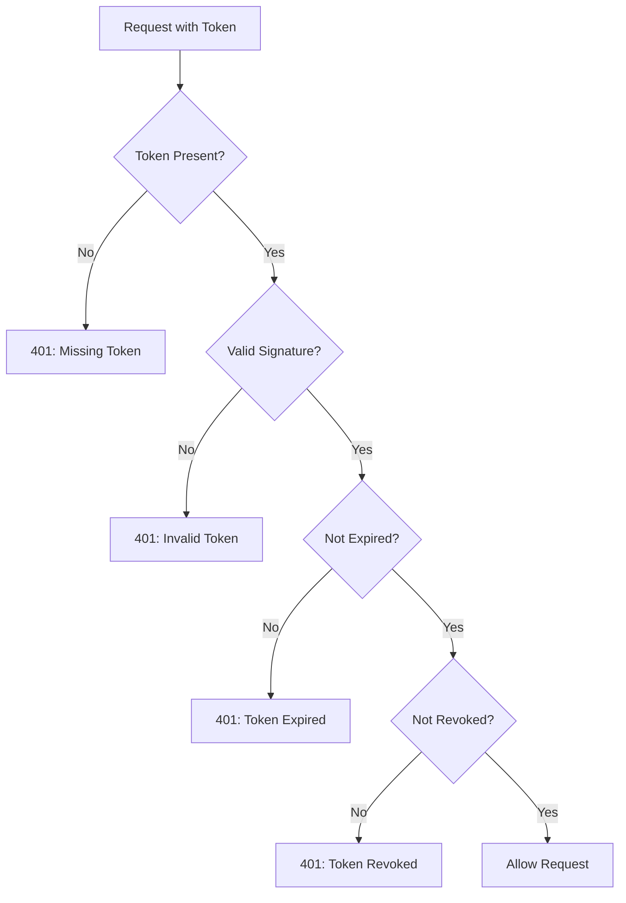

# User Flow for Day 2: Firebase Authentication

This document illustrates the complete parent authentication journey with diagrams and step-by-step flows.

---

## Overview

This document covers three main authentication flows:
1. **Email Registration and Verification Flow**
2. **Phone Registration and Verification Flow**
3. **Google OAuth Registration Flow**
4. **Login Flows** (Email, Phone, Google)
5. **Session Management Flow**

---

## Flow 1: Email Registration and Verification

### User Journey

```
Parent → Registration → Email Verification → Login → Access Platform
```

### Detailed Flow Diagram



### Step-by-Step Breakdown

#### Step 1: Registration (Day 1)
**Parent Action**: Fills registration form
- Email: parent@example.com
- Password: SecurePass123
- Language: English

**Backend Action**:
- Creates Firebase Auth user
- Stores profile in Firestore `parents` collection
- Returns `verification_required: true`

**Result**: Account created but not verified

---

#### Step 2: Send Verification Email (Day 2)
**Parent Action**: Clicks "Send Verification Email"

**Backend Action**:
1. Generate 6-digit verification code
2. Store in Firestore `verification_codes` collection:
   ```json
   {
     "email": "parent@example.com",
     "code": "ABC123",
     "created_at": "2024-01-15T10:00:00Z",
     "expires_at": "2024-01-15T10:10:00Z",
     "used": false
   }
   ```
3. Send email with code (or link with code)

**Result**: Parent receives email with verification code

---

#### Step 3: Confirm Email Verification
**Parent Action**: Enters verification code from email

**Backend Action**:
1. Find verification code in Firestore
2. Check if code matches
3. Check if code is not expired (< 10 minutes old)
4. Check if code is not already used
5. Update Firebase Auth: `email_verified = true`
6. Update Firestore parent profile: `email_verified = true`
7. Mark code as used

**Result**: Email verified, parent can now login

---

#### Step 4: Login
**Parent Action**: Enters email and password

**Backend Action**:
1. Verify credentials with Firebase Auth
2. Get parent profile from Firestore
3. Generate JWT access token (expires in 24 hours)
4. Generate JWT refresh token (expires in 30 days)
5. Store session in Firestore `sessions` collection
6. Return tokens to frontend

**Result**: Parent is logged in with valid session

---

#### Step 5: Access Protected Resources
**Parent Action**: Navigates to any page

**Frontend Action**: Includes token in Authorization header

**Backend Action**:
1. Extract token from Authorization header
2. Verify JWT signature
3. Check token expiry
4. Check if token is revoked (in sessions collection)
5. Get user info from token payload
6. Return requested data

**Result**: Parent can access protected resources

---

## Flow 2: Phone Registration and Verification

### User Journey

```
Parent → Registration → Phone OTP → Login → Access Platform
```

### Detailed Flow Diagram



### Step-by-Step Breakdown

#### Step 1: Registration (Day 1)
**Parent Action**: Enters phone number
- Phone: +919876543210
- Language: Hindi

**Backend Action**:
- Creates Firebase Auth user with phone
- Stores profile in Firestore
- Returns `verification_required: true`

---

#### Step 2: Send Phone OTP
**Parent Action**: Clicks "Send OTP"

**Backend Action**:
1. Generate 6-digit OTP
2. Store in Firestore `verification_codes` collection:
   ```json
   {
     "phone": "+919876543210",
     "otp": "123456",
     "created_at": "2024-01-15T10:00:00Z",
     "expires_at": "2024-01-15T10:10:00Z",
     "used": false
   }
   ```
3. Send SMS with OTP

**Result**: Parent receives SMS with OTP

---

#### Step 3: Confirm Phone OTP
**Parent Action**: Enters OTP from SMS

**Backend Action**:
1. Find OTP in Firestore
2. Verify OTP matches
3. Check not expired (< 10 minutes)
4. Check not already used
5. Update parent profile: `phone_verified = true`
6. Mark OTP as used

**Result**: Phone verified

---

#### Step 4: Login with Phone
**Parent Action**: Enters phone number, requests OTP

**Backend Action**:
1. Generate new login OTP
2. Store in Firestore
3. Send SMS

**Parent Action**: Enters OTP

**Backend Action**:
1. Verify OTP
2. Get user from Firebase Auth
3. Generate tokens
4. Store session
5. Return tokens

**Result**: Parent logged in

---

## Flow 3: Google OAuth Registration and Login

### User Journey

```
Parent → Click "Sign in with Google" → Google Auth → Auto-verified → Access Platform
```

### Detailed Flow Diagram



### Step-by-Step Breakdown

#### Step 1: Initiate Google Sign-In
**Parent Action**: Clicks "Sign in with Google" button

**Frontend Action**:
- Redirects to Google OAuth consent screen
- Requests email and profile permissions

---

#### Step 2: Google Authentication
**Parent Action**: 
- Logs into Google account
- Grants permissions

**Google Action**:
- Authenticates user
- Returns ID token to frontend

---

#### Step 3: Backend Verification
**Frontend Action**: Sends ID token to backend

**Backend Action**:
1. Verify ID token with Firebase Admin SDK
2. Extract user info (email, name, Google UID)
3. Check if user exists in Firebase Auth
4. If new user:
   - Create Firebase Auth user
   - Create parent profile in Firestore
   - Set `email_verified = true` (Google verified)
5. If existing user:
   - Get parent profile from Firestore
6. Generate tokens
7. Store session

**Result**: Parent logged in, no verification needed

---

## Flow 4: Session Management

### Token Lifecycle



### Token Refresh Flow



### Logout Flow



---

## Flow 5: Protected Endpoint Access

### Request Flow with Authentication



### Error Scenarios



---

## Complete User Journey Example

### Scenario: New Parent Registration to First Login

**Day 1: Registration**
1. Parent visits website
2. Clicks "Register"
3. Chooses "Email Registration"
4. Enters: email, password, language
5. Submits form
6. Sees: "Registration successful! Please verify your email"

**Day 2: Verification**
7. Clicks "Send Verification Email"
8. Receives email with code
9. Enters verification code
10. Sees: "Email verified successfully!"

**Day 2: First Login**
11. Clicks "Login"
12. Enters email and password
13. Submits form
14. Redirected to dashboard
15. Token stored in browser

**Day 2: Using Platform**
16. Navigates to different pages
17. Each request includes token
18. Backend verifies token
19. Returns requested data
20. Parent uses platform features

**Day 2: Logout**
21. Clicks "Logout"
22. Token revoked
23. Redirected to login page
24. Must login again to access

---

## Data Flow Summary

### Firestore Collections Structure

```
firestore/
├── parents/
│   └── {parent_id}/
│       ├── parent_id: string
│       ├── email: string (optional)
│       ├── phone: string (optional)
│       ├── language: string
│       ├── role: "parent"
│       ├── email_verified: boolean
│       ├── phone_verified: boolean
│       ├── created_at: timestamp
│       └── updated_at: timestamp
│
├── verification_codes/
│   └── {code_id}/
│       ├── email: string (or phone)
│       ├── code: string (or otp)
│       ├── created_at: timestamp
│       ├── expires_at: timestamp
│       └── used: boolean
│
└── sessions/
    └── {session_id}/
        ├── parent_id: string
        ├── token: string (hashed)
        ├── refresh_token: string (hashed)
        ├── created_at: timestamp
        ├── expires_at: timestamp
        └── revoked: boolean
```

---

## Key Takeaways

### For Developers

1. **Email verification** requires two-step process: send code, confirm code
2. **Phone verification** uses OTP with expiry for security
3. **Google OAuth** is single-step, automatically verified
4. **Tokens** have different lifetimes: access (24h), refresh (30d)
5. **Sessions** are stored in Firestore for revocation capability
6. **Middleware** handles authentication for all protected endpoints

### For Users

1. **Email users** must verify before full access
2. **Phone users** receive OTP via SMS
3. **Google users** skip verification (Google already verified)
4. **Sessions** stay active for 24 hours
5. **Tokens** refresh automatically before expiry
6. **Logout** immediately revokes access

---

## Next Steps

After understanding these flows, you can:
1. Implement the code using PROMPTS.md
2. Test each flow using TESTING.md
3. Verify success using EXPECTED-OUTCOME.md
4. Troubleshoot issues using TROUBLESHOOTING.md

The flows in Day 3 (User Onboarding) will build on these authentication flows to collect user preferences and child information.
